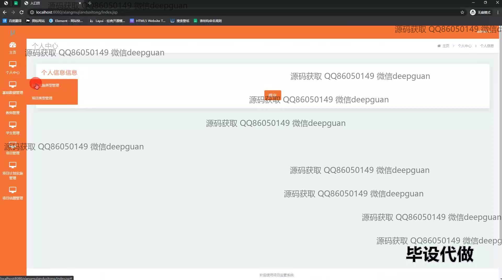
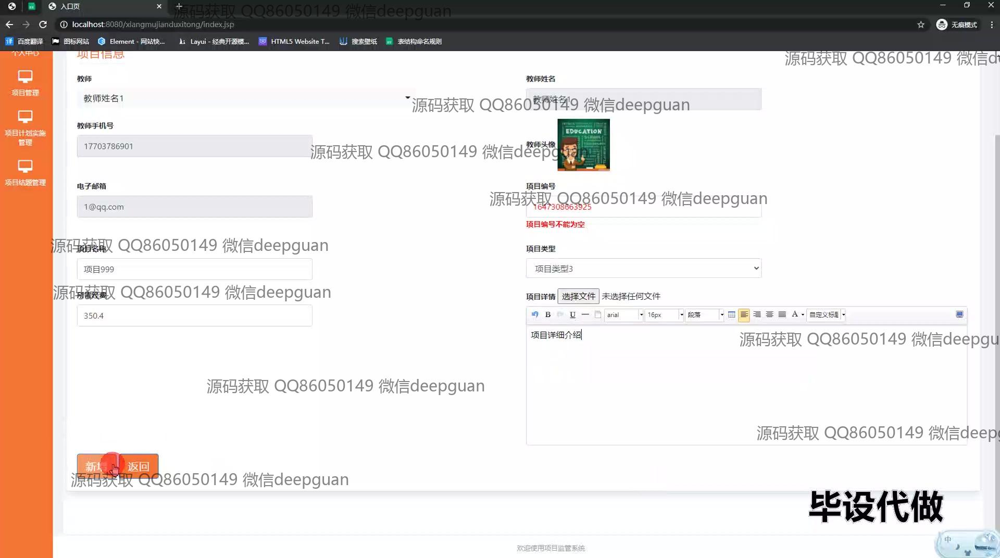

<h1 align="center">基于BS的项目监管系统+jsp</h1>

## 简介
项目监管系统：角色分为管理员、学生、教师；功能包括项目管理、计划实施、结题管理、用户中心，支持信息录入、审核、查询及文件上传，简化高校项目监管流程。    --计算机毕业设计源码；毕设源码；java毕业设计源码

## 联系方式

<h3 align="center">获取完整代码与数据库文件 + 微信：deepguan QQ: 86050149 QQ群: 783742310</h3>

<h3 align="center">可帮忙远程部署 包运行成功！提供远程部署、修改代码、设计文档指导、代码讲解等服务！</h3>

## 功能介绍（完整见运行截图）
管理员：项目管理中，管理员可以登录后实现对项目信息的查看、添加、修改和删除，管理项目计划、结题等状态和相关信息。支持数据批量操作、审核状态管理、文件上传以及用户角色和权限管理，确保项目数据和操作的规范性和安全性。个人中心功能为管理员提供个人信息查看与管理。

教师：教师用户通过系统可登录后管理自身负责的项目，进行项目的计划和实施细节录入，查看和更新审核意见及状态，上传相关文件，并在项目结题管理模块进行结题信息的输入和费用操作。导航栏提供快捷访问个人中心和项目模块。

学生：学生用户在登录后，可创建与管理申请项目，录入相关项目计划实施细节，包括项目类型、实施名称、审核状态等。平台允许学生查看项目进度、提交结题信息、参与项目计划实施管理，并可对未缴费项目进行结题操作。

一般用户：项目监管系统提供用户注册和修改个人信息功能。用户可在主页访问项目相关信息和个人中心模块，通过导航栏切换不同模块，实现对项目计划和实施的高效管理。

## 运行截图

本代码来源于网络,仅供学习参考使用!

